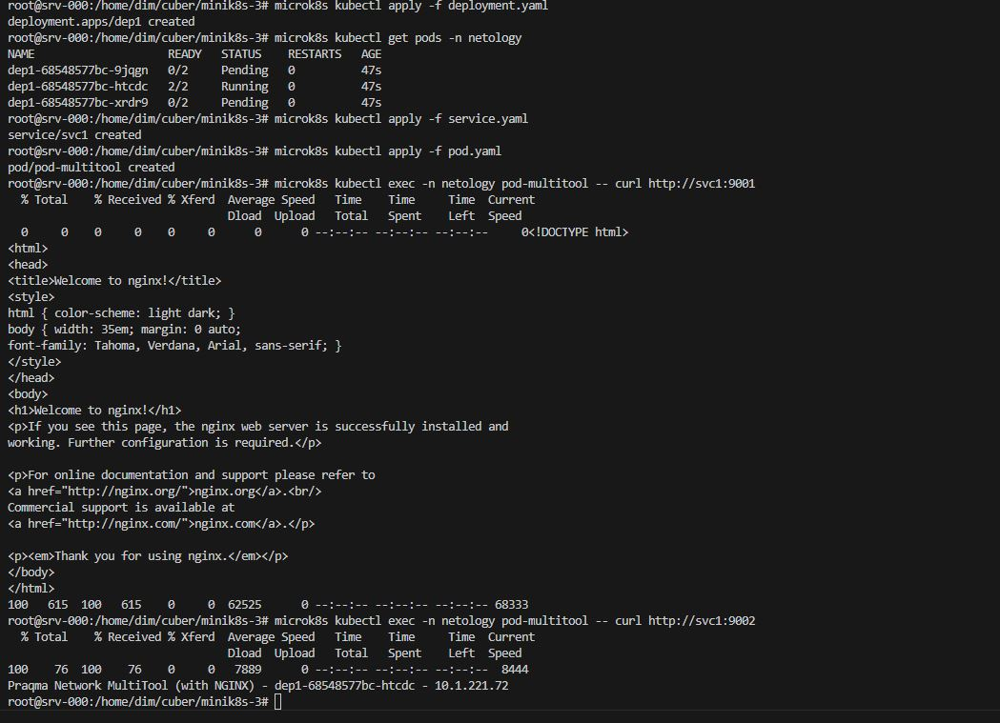
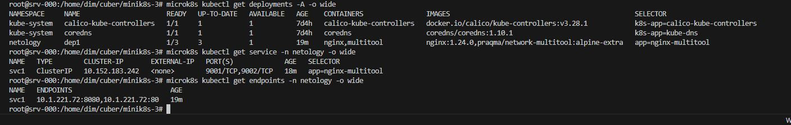
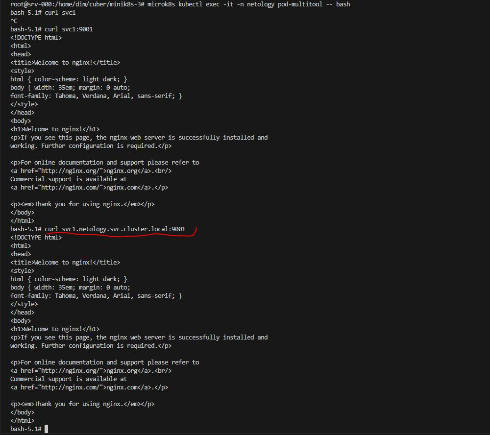
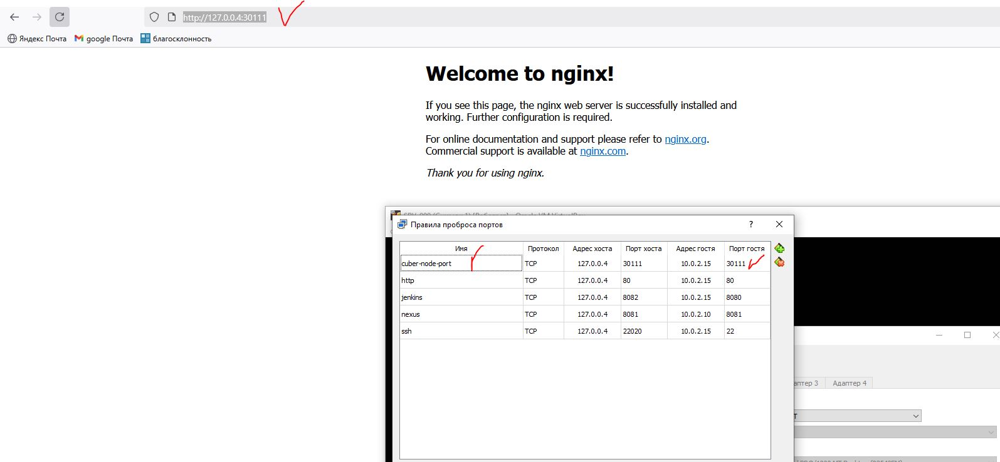

# Домашнее задание к занятию «Сетевое взаимодействие в K8S. Часть 1»


### Цель задания

В тестовой среде Kubernetes необходимо обеспечить доступ к приложению, установленному в предыдущем ДЗ и состоящему из двух контейнеров, по разным портам в разные контейнеры как внутри кластера, так и снаружи.

------

### Чеклист готовности к домашнему заданию

1. Установленное k8s-решение (например, MicroK8S).
2. Установленный локальный kubectl.
3. Редактор YAML-файлов с подключённым Git-репозиторием.

------

### Инструменты и дополнительные материалы, которые пригодятся для выполнения задания

1. [Описание](https://kubernetes.io/docs/concepts/workloads/controllers/deployment/) Deployment и примеры манифестов.
2. [Описание](https://kubernetes.io/docs/concepts/services-networking/service/) Описание Service.
3. [Описание](https://github.com/wbitt/Network-MultiTool) Multitool.

------

### Задание 1. Создать Deployment и обеспечить доступ к контейнерам приложения по разным портам из другого Pod внутри кластера

1. Создать Deployment приложения, состоящего из двух контейнеров (nginx и multitool), с количеством реплик 3 шт.
2. Создать Service, который обеспечит доступ внутри кластера до контейнеров приложения из п.1 по порту 9001 — nginx 80, по 9002 — multitool 8080.
3. Создать отдельный Pod с приложением multitool и убедиться с помощью `curl`, что из пода есть доступ до приложения из п.1 по разным портам в разные контейнеры.
4. Продемонстрировать доступ с помощью `curl` по доменному имени сервиса.
5. Предоставить манифесты Deployment и Service в решении, а также скриншоты или вывод команды п.4.

**Ответ.**

создаем пространство имен

[ns.yaml](ns.yaml)

    <details><summary>ns.yaml</summary>

    ```yaml
    ---
    apiVersion: v1
    kind: Namespace
    metadata:
        name: netology
        namespace: netology
    ...
    ```

    </details>


1. [deployment.yaml](deployment.yaml)

    <details><summary>deployment.yaml</summary>

    ```yaml
    ---
    apiVersion: apps/v1
    kind: Deployment
    metadata:
    name: dep1
    labels:
        task: one
        tier: homework
    annotations:
        container1: nginx
        container2: multitools
    namespace: netology
    spec:
    replicas: 3
    strategy:
        rollingUpdate:
        maxSurge: 1
        maxUnavailable: 1
        type: RollingUpdate
    selector:
        matchLabels:
        app: nginx-multitool
    template:
        metadata:
        labels:
            app: nginx-multitool
        spec:
        containers:
            - name: nginx
            image: nginx:1.24.0
            resources:
                limits:
                memory: "128Mi"
                cpu: "500m"
                requests:
                memory: "64Mi"
                cpu: "250m"
            ports:
                - name: web
                containerPort: 80
            livenessProbe:
                tcpSocket:
                port: 80
                initialDelaySeconds: 10
                timeoutSeconds: 3
            readinessProbe:
                httpGet:
                path: /
                port: 80
                initialDelaySeconds: 15
                timeoutSeconds: 5
                successThreshold: 1
                failureThreshold: 4
            - name: multitool
            image: praqma/network-multitool:alpine-extra
            resources:
                limits:
                memory: "128Mi"
                cpu: "450m"
                requests:
                memory: "32Mi"
                cpu: "150m"
            env:
                - name: HTTP_PORT
                value: "8080"
                - name: HTTPS_PORT
                value: "8443"
            ports:
                - name: http
                containerPort: 8080
                protocol: TCP
                - name: https
                containerPort: 8443
                protocol: TCP
            livenessProbe:
                tcpSocket:
                port: 8080
                initialDelaySeconds: 10
                timeoutSeconds: 3
            readinessProbe:
                httpGet:
                path: /
                port: 8080
                initialDelaySeconds: 15
                timeoutSeconds: 5
                successThreshold: 1
                failureThreshold: 2
    ...
    ```

    </details>

2. [service.yaml](service.yaml)

    <details><summary>service.yaml</summary>

    ```yaml
    ---
    apiVersion: v1
    kind: Service
    metadata:
    name: svc1
    namespace: netology
    spec:
    selector:
        app: nginx-multitool
    type: ClusterIP
    ports:
        - name: nginx
        port: 9001
        targetPort: 80
        - name: multitool
        port: 9002
        targetPort: 8080
    ...
    ```

    </details>

3. [pod.yaml](pod.yaml)

    <details><summary>pod.yaml</summary>

    ```yaml
    ---
    apiVersion: v1
    kind: Pod
    metadata:
    name: pod-multitool
    labels:
        app: multitool
        comment: testig-app
        company: netology
        stage: study
    namespace: netology
    spec:
    containers:
        - name: multitool
        image: praqma/network-multitool:alpine-extra
        resources:
            limits:
            memory: "128Mi"
            cpu: "600m"
            requests:
            memory: "32Mi"
            cpu: "100m"
        env:
            - name: HTTP_PORT
            value: "8090"
        ports:
            - name: http
            containerPort: 8090
            protocol: TCP
        livenessProbe:
            tcpSocket:
            port: 8090
            initialDelaySeconds: 10
            timeoutSeconds: 3
        readinessProbe:
            httpGet:
            path: /
            port: 8090
            initialDelaySeconds: 15
            timeoutSeconds: 5
            successThreshold: 1
            failureThreshold: 2
    ...
    ```

    </details>
4. 
    
    
    


------

### Задание 2. Создать Service и обеспечить доступ к приложениям снаружи кластера

1. Создать отдельный Service приложения из Задания 1 с возможностью доступа снаружи кластера к nginx, используя тип NodePort.
2. Продемонстрировать доступ с помощью браузера или `curl` с локального компьютера.
3. Предоставить манифест и Service в решении, а также скриншоты или вывод команды п.2.

**Ответ.**


1. [nodeport](nodeport.yaml)

    <details><summary>nodeport.yaml</summary>

    ```yaml
    ---
    apiVersion: v1
    kind: Service
    metadata:
    name: svc-nodeport
    namespace: netology
    spec:
    selector:
        app: nginx-multitool
    type: NodePort
    ports:
        - name: nginx
        port: 80
        nodePort: 30111
        - name: multitool
        port: 8080
        nodePort: 30112
    ...
    ```

    </details>

2. 

### Правила приёма работы

1. Домашняя работа оформляется в своем Git-репозитории в файле README.md. Выполненное домашнее задание пришлите ссылкой на .md-файл в вашем репозитории.
2. Файл README.md должен содержать скриншоты вывода необходимых команд `kubectl` и скриншоты результатов.
3. Репозиторий должен содержать тексты манифестов или ссылки на них в файле README.md.

